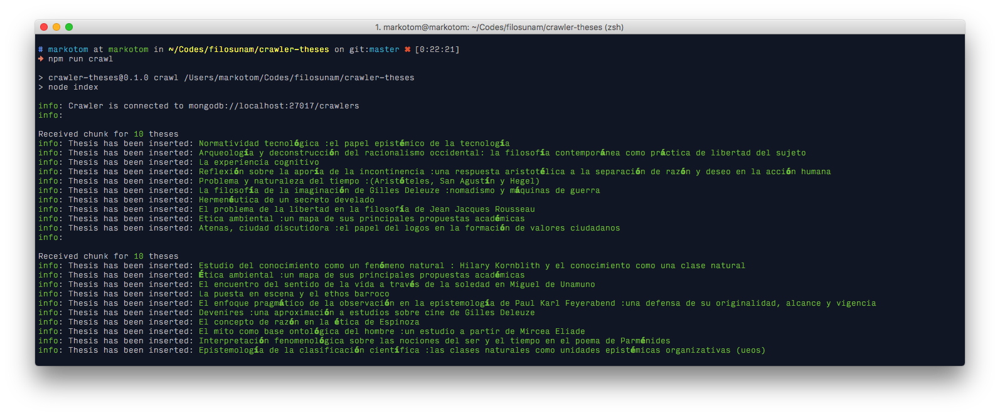
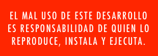

Rastreador de tesis
===================

**Requerimientos**:

* Node.js >= 6
* MongoDB

## Instalación

Una vez instalado [node.js](https://nodejs.org/en/), desde la terminal o consola instalamos los componentes necesarios:

```
$ npm install
```

## Configuración

Crear un archivo de configuración del entorno requerido basado en [config/default.js](./config/default.js) (v. g. config/development.js, config/production.js). Añadir las opciones requeridas para la base de datos.

## Uso

En la terminal, ejecuta el siguiente *script*:

```
$ node tasks/scrap --career filosofia --since 2005 --until 2017
```

Luego, empezará el rastreo por paquetes de datos:



## Tareas

#### Limpiar Datos

```
$ node tasks/clean
```

#### Tokenizing

```
$ node tasks/keywords
```

## Licencia

MIT



