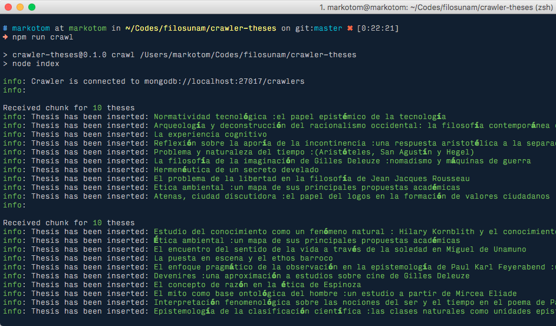

Rastreador de tesis
===================

**Requerimientos**:

* Node.js >= 6
* MongoDB

## Instalación

Una vez instalado [node.js](https://nodejs.org/en/), desde la terminal o consola instalamos los componentes necesarios:

```
$ npm install
```

## Configuración

Crear un archivo de configuración del entorno requerido basado en [config/default.js](./config/default.js) (v. g. config/development.js, config/production.js). Añadir las opciones requeridas para la base de datos y los criterios de búsqueda.

## Uso

En la terminal, ejecuta el siguiente *script*:

```
$ npm run crawl
```

Luego, empezará el rastreo por paquetes de datos:



## Licencia

MIT


